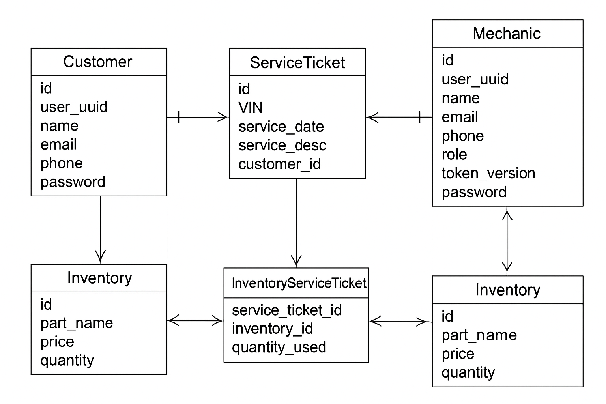

# Mechanic Service API

Designed and implemented a Flask-based REST API using SQLAlchemy for database modeling, providing secure, role-based endpoints for managing customers, mechanics, inventory, and service tickets, with full Swagger UI documentation and CI/CD integration.

---

## Table of Contents

1. [Features](#features)
2. [Tech Stack](#tech-stack)
3. [Installation](#installation)
4. [Entity-Relationship-Diagram](#entity-relationship-diagram)
5. [API Endpoints](#api-endpoints)
6. [Swagger UI](#swagger-ui)
7. [Unit Testing](#unit-testing)
8. [Swagger CLI and Nodemon](#swagger-cli-and-nodemon)

---

## Features

## Features

- **Full CRUD Operations:** Manage customers, mechanics, inventory parts, and service tickets with create, read, update, and delete endpoints.
- **Relational Database Support:**
  - One-to-many relationships (Customer → ServiceTicket)
  - Many-to-many relationships with extra fields (ServiceTicket ↔ Mechanic via ServiceTicketMechanic)
  - Many-to-many relationships (ServiceTicket ↔ Inventory via ServiceTicketInventory)
- **Role-Based Access Control (RBAC):**
  - Restrict actions based on user roles (mechanic vs. customer)
  - JWT authentication ensures secure endpoints
- **Automatic Validation and Serialization:**
  - Marshmallow schemas validate incoming data and serialize responses
- **Rate Limiting and Caching:**
  - Prevent abuse of API endpoints using rate limiting
  - Cache frequently accessed data for improved performance
- **Swagger UI Integration:**
  - Interactive API documentation allows developers to explore and test endpoints easily
- **Swagger CLI + Nodemon Support:**
  - Automatically rebuild merged Swagger documentation when YAML files change
- **Unit Testing Coverage:**
  - Pre-built Python `unittest` tests for all major endpoints
  - Tests cover CRUD operations, role restrictions, and edge cases
- **Error Handling:**
  - Provides clear JSON responses for invalid IDs, forbidden actions, or validation errors
- **Extensible Architecture:**
  - Built with the Flask Application Factory pattern for easy expansion and modularity

---

## Tech Stack

- **Backend:** Python, Flask
- **Database:** MySQL
- **ORM:** SQLAlchemy
- **Serialization:** Flask-Marshmallow, Marshmallow-SQLAlchemy

---

## Installation

```bash
git clone https://github.com/putman44/Project-Advanced-API-Development
cd Project-Advanced-API-Development

python3 -m venv .venv
source .venv/bin/activate  # Mac/Linux
venv\Scripts\activate     # Windows

npm install -g @apidevtools/swagger-cli nodemon
pip install -r requirements.txt
```

## Entity-Relationship-Diagram



## API Endpoints

### Customers

| Method | Endpoint                           | Description        |
| ------ | ---------------------------------- | ------------------ |
| POST   | /customers                         | Create a customer  |
| GET    | /customers                         | List all customers |
| GET    | /customers/&lt;int:customer_id&gt; | Get a customer     |
| PUT    | /customers/&lt;int:customer_id&gt; | Update a customer  |
| DELETE | /customers/&lt;int:customer_id&gt; | Delete a customer  |

### Mechanics

| Method | Endpoint                           | Description        |
| ------ | ---------------------------------- | ------------------ |
| POST   | /mechanics                         | Create a mechanic  |
| GET    | /mechanics                         | List all mechanics |
| GET    | /mechanics/&lt;int:mechanic_id&gt; | Get a mechanic     |
| PUT    | /mechanics/&lt;int:mechanic_id&gt; | Update a mechanic  |
| DELETE | /mechanics/&lt;int:mechanic_id&gt; | Delete a mechanic  |

### Service Tickets

| Method | Endpoint                                                           | Description                                     |
| ------ | ------------------------------------------------------------------ | ----------------------------------------------- |
| POST   | /service_tickets                                                   | Create a service ticket                         |
| GET    | /service_tickets                                                   | List all service tickets                        |
| GET    | /service_tickets/&lt;int:service_ticket_id&gt;                     | Get a service ticket                            |
| GET    | /service_tickets/most-tickets                                      | Get the mechanics with the most service tickets |
| PUT    | /service_tickets/&lt;int:service_ticket_id&gt;/update-part         | Update a service ticket parts                   |
| PUT    | /service_tickets/&lt;int:service_ticket_id&gt;/update-mechanics    | Update a service ticket mechanics               |
| PUT    | /service_tickets/&lt;int:service_ticket_id&gt;/service-ticket-info | Update a service ticket's information           |
| DELETE | /service_tickets/&lt;int:service_ticket_id&gt;                     | Delete a service ticket                         |

### Inventories

| Method | Endpoint                              | Description              |
| ------ | ------------------------------------- | ------------------------ |
| POST   | /inventories                          | Create an inventory part |
| GET    | /inventories                          | List all inventory parts |
| GET    | /inventories/&lt;int:inventory_id&gt; | Get an inventory part    |
| PUT    | /inventories/&lt;int:inventory_id&gt; | Update an inventory part |
| DELETE | /inventories/&lt;int:inventory_id&gt; | Delete an inventory part |

```

```

## Swagger UI

This project includes Swagger documentation to easily explore and test the API.

Once the app is running, visit:
https://project-advanced-api-development.onrender.com/api/docs/

## Unit Testing

Unit tests are included for all major functionality using Python’s unittest framework.

Activate your virtual environment:

    source .venv/bin/activate # Mac/Linux
    venv\Scripts\activate # Windows

Run all tests in the app/tests folder:

    python -m unittest discover -s app/tests

Test results will show pass/fail status for each endpoint and function.

### What is Tested

CRUD operations for customers, mechanics, inventories, and service tickets.

Role-based access restrictions.

Service ticket assignments and part usage.

Edge cases like invalid IDs and forbidden actions.

## Swagger CLI and Nodemon

This project uses swagger-cli and nodemon to manage and automatically rebuild the Swagger API documentation.

    @apidevtools/swagger-cli – Used to bundle multiple Swagger YAML files into a single merged specification.

    nodemon – Watches files for changes and automatically executes a command when changes are detected.

To run:

    npm run watch-swagger

Whenever you update any Swagger YAML file, the merged specification will automatically regenerate in swagger_build/merged.yaml. You can then view it in Swagger UI.
